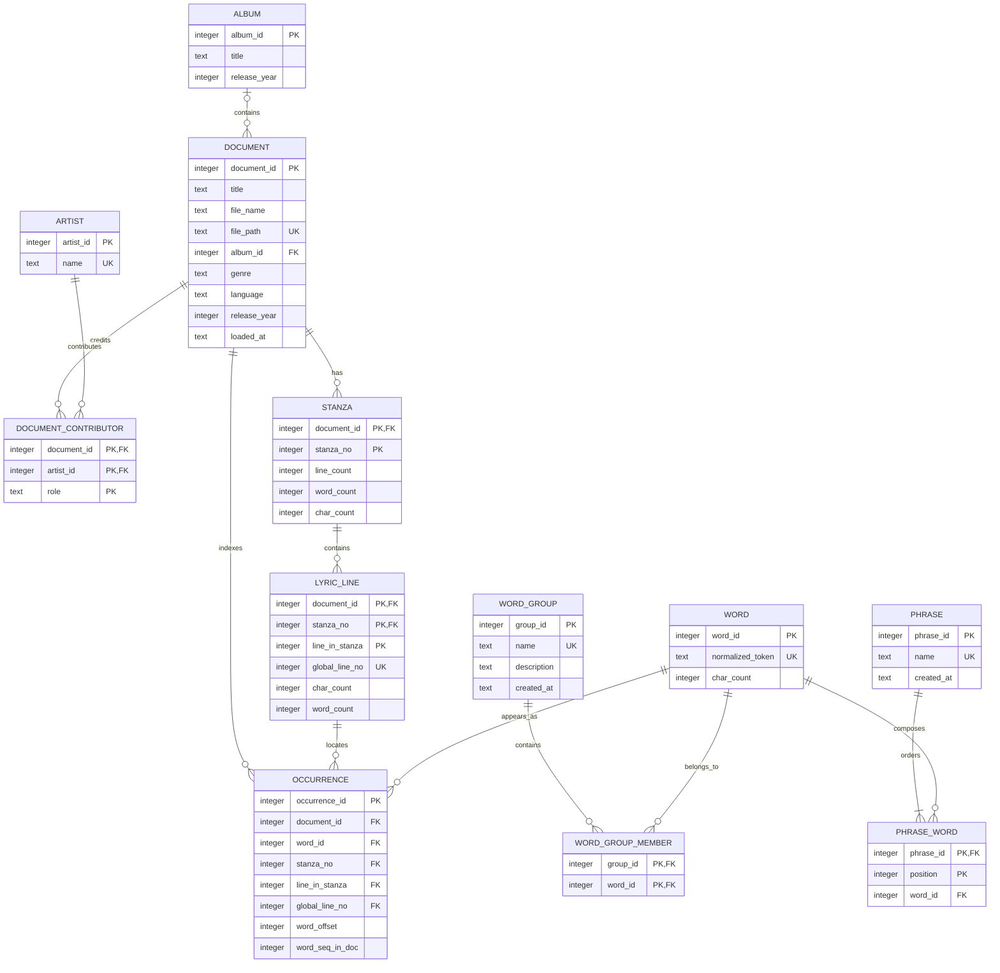

# LyriConc Entity-Relationship Diagram

The diagram reflects the executable schema in [schema.sql](schema.sql). Full
lyric lines are deliberately absent: `lyric_line` stores positions and counts,
and `document.file_path` points to the source text used for context display.

## Cardinality Notes

- A document may belong to zero or one album; an album may contain many songs.
- Artists and documents have a many-to-many relationship resolved by
  `document_contributor`, whose role distinguishes performers, lyricists, and
  composers.
- A document has ordered stanzas, each stanza has ordered lyric lines, and each
  line has zero or more indexed occurrences.
- One normalized word may appear in many documents and positions.
- Words and user groups have a many-to-many relationship.
- A phrase contains one or more ordered phrase-word rows. A vocabulary word may
  participate in many phrases.
